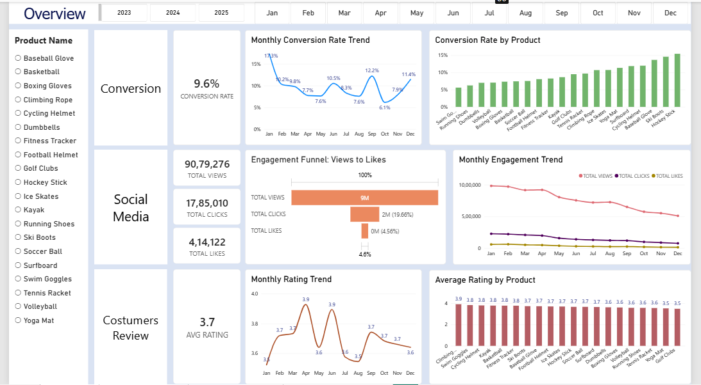
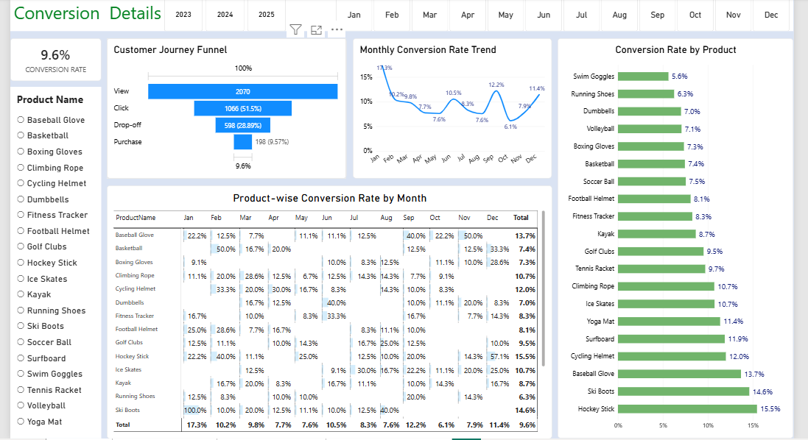
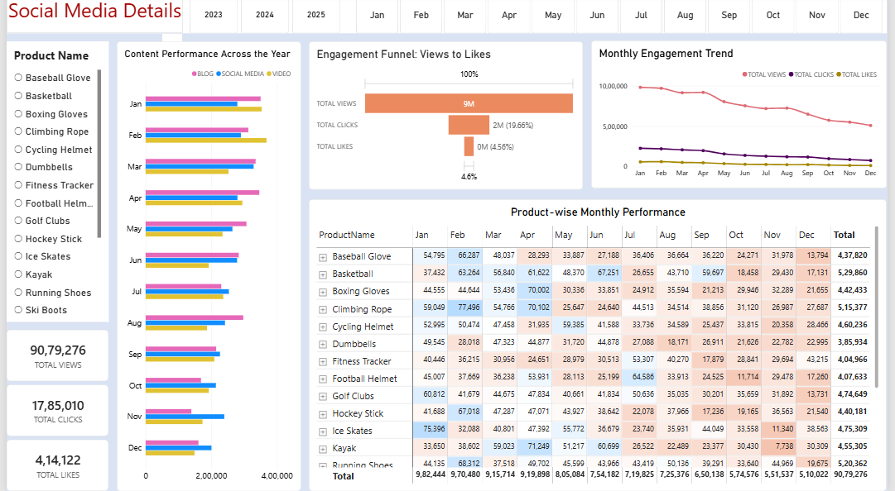
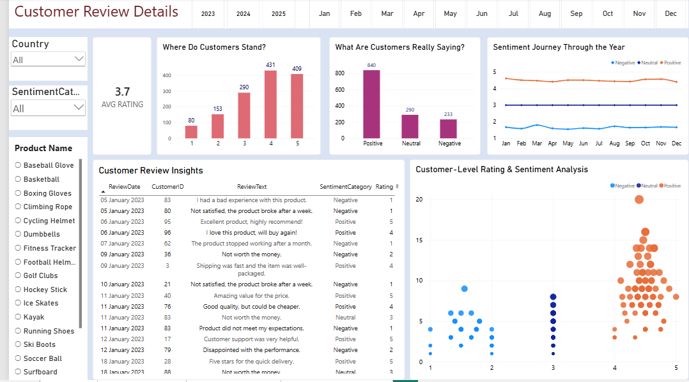

# ShopEasy Marketing Analytics

## TL;DR

Analyzed ShopEasy's marketing performance across **conversion, customer
engagement, and customer feedback** data. Cleaned and prepared raw data
using **SQL**, enriched customer reviews with **Python**, and built a
**4-page interactive Power BI dashboard** to identify
month/product-level conversion variability, a decline in engagement in
the second half of the year, and a customer-rating gap versus the 4.0
target.

## Business Problem

ShopEasy is an online retailer facing:

-   Declining customer engagement
-   Lower conversion performance
-   Increasing marketing spend without expected returns
-   A need to understand customer feedback and pain points

The project focuses on using marketing and customer data to identify
improvement opportunities.

## Key Objectives

  
  Objective                           Analysis Focus

  Increase conversions                Monthly/product trends and
                                      conversion funnel

  Improve engagement                  Views, clicks, likes and content
                                      types

  Improve customer satisfaction       Ratings, sentiment and review
                                      patterns


## Approach

1.  **Data Cleaning (SQL)** --- Cleaned and structured raw customer,
    product, journey, review, and engagement tables before modeling.
2.  **Sentiment Enrichment (Python)** --- Converted star ratings (1-5)
    into a normalized sentiment score (-1 to 1), sentiment category
    (Positive/Neutral/Negative), and sentiment bucket using Pandas.
3.  **Final Cleanup (Power Query)** --- Resolved remaining text
    inconsistencies (e.g. extra whitespace) before modeling.
4.  **Dashboard & Visualization (Power BI)** --- Built an interactive
    4-page dashboard to surface conversion, engagement, and feedback
    insights.

## Key Findings

### Conversion

-   Conversion performance varies considerably by month and product.
-   **January** had the highest overall conversion rate at **18.5%**.
-   **May** was the lowest-performing month at **4.3%**.
-   **December** rebounded to **10.2%** after a **5.0%** result in
    October.
-   February and July also showed relatively strong product-level
    conversion performance, indicating potential seasonal opportunities.

### Customer Engagement

-   Views peaked around **February and July** and declined from **August
    onward**.
-   Clicks and likes remained low relative to views, indicating an
    opportunity to improve content engagement and calls to action.
-   **Blog content** generated the strongest view performance,
    particularly in April and July.
-   Social media and video content showed comparatively steady but lower
    view performance.

### Customer Feedback

-   Average customer rating remained around **3.7**, below the **4.0
    target**.
-   The largest rating groups were **4-star (140 reviews)** and **5-star
    (135 reviews)**.
-   **275 reviews** were classified as positive sentiment, compared with
    **82 negative reviews**.
-   Mixed and negative feedback provides an opportunity to identify
    recurring customer issues and improve satisfaction.

## Dashboard Preview

### Overview Dashboard



### Conversion Details



### Social Media Details



### Customer Review Details



## Power BI Dashboard

The report is organized into four pages:

1.  **Overview** --- high-level KPIs and trends
2.  **Conversion Details** --- conversion performance and customer
    journey
3.  **Social Media Details** --- views, clicks, likes and content
    performance
4.  **Customer Review Details** --- ratings, sentiment and review
    analysis

Interactive filtering allows the analysis to be explored by dimensions
such as product, month/year, content type, and customer attributes.

## Data Cleaning (SQL)

Raw tables were cleaned and standardized using SQL Server before being
loaded into Power BI:

-   **Customer & Geography data** --- joined `customers` and `geography`
    tables to enrich customer records with country/city information.
-   **Product data** --- categorized products into Low/Medium/High price
    tiers using conditional logic.
-   **Customer Journey data** --- identified and removed duplicate
    journey records using `ROW_NUMBER()` window functions, and filled
    missing `Duration` values with the average duration per date.
-   **Customer Reviews** --- initial whitespace cleanup attempted in
    SQL; remaining inconsistencies resolved later in Power Query.
-   **Engagement data** --- standardized `ContentType` labels
    (e.g. merged "Socialmedia" into "Social Media"), split combined
    Views/Clicks fields into separate columns, reformatted dates, and
    excluded irrelevant content types (e.g. Newsletter).

Example --- deduplicating customer journey records:

``` sql
WITH DuplicateRecords AS (
    SELECT 
        JourneyID, CustomerID, ProductID, VisitDate, Stage, Action, Duration,
        ROW_NUMBER() OVER (
            PARTITION BY CustomerID, ProductID, VisitDate, Stage, Action  
            ORDER BY JourneyID  
        ) AS row_num
    FROM dbo.customer_journey
)
SELECT * FROM DuplicateRecords WHERE row_num > 1;
```

Full scripts available in `dim_customers.sql`, `dim_products.sql`,
`fact_customerjourney.sql`, `fact_customers_review.sql`, and
`fact_engagemnetdata.sql`.

## Sentiment Enrichment (Python)

Customer reviews were enriched using a rating-based sentiment scoring
approach in Pandas:

-   Converted each review's star rating (1--5) into a normalized
    **SentimentScore** between -1 and 1.
-   Classified each score into a **SentimentCategory** (Positive /
    Neutral / Negative).
-   Assigned a matching **SentimentBucket** so category and bucket
    always agree.

``` python
def calculate_sentiment(rating):
    return (rating - 3) / 2

def categorize_sentiment(score):
    if score > 0.05:
        return 'Positive'
    elif score < -0.05:
        return 'Negative'
    else:
        return 'Neutral'
```

Full script available in `customers_review_enrichment.ipynb`.

## Recommendations

### 1. Improve Conversion

-   Focus marketing activity on products with stronger demonstrated
    conversion performance.
-   Use seasonal promotions and targeted campaigns around
    stronger-performing periods.
-   Investigate lower-performing months and funnel stages to identify
    opportunities for optimization.

### 2. Improve Engagement

-   Test more interactive content formats, including video and
    user-generated content.
-   Strengthen and reposition calls to action.
-   Use the stronger-performing blog channel as a foundation while
    testing ways to increase interaction, not just views.
-   Give additional attention to the historically weaker engagement
    period from September to December.

### 3. Improve Customer Feedback

-   Create a structured feedback loop for mixed and negative reviews.
-   Identify recurring product/service issues.
-   Use customer feedback to prioritize product and service
    improvements.
-   Track progress toward the **4.0 average-rating target**.

## Data & Dashboard Structure

The Power BI model includes logical entities for:

-   `Calendar`
-   `dim_products`
-   `dim_customers`
-   `Fact_customer_journey`
-   `Fact_engagement_data`
-   `fact_customer_reviews_with_sentiment`

All fact and dimension tables were cleaned and prepared using SQL prior
to modeling in Power BI. Sentiment fields in
`fact_customer_reviews_with_sentiment` were generated via a Python
enrichment script (rating-based scoring), then loaded into Power BI.

### Core KPIs

-   **Conversion Rate** --- percentage of website visitors who make a
    purchase
-   **Customer Engagement Rate** --- interaction with marketing content
-   **Average Order Value (AOV)** --- average amount spent per
    transaction
-   **Customer Feedback Score** --- average customer review rating

## Tools

-   **SQL Server** --- data cleaning, deduplication, and preprocessing
-   **Python (Pandas)** --- rating-based sentiment enrichment
-   **Power Query (Power BI)** --- final data cleanup and transformation
-   **Power BI** --- data modeling, DAX/KPIs, interactive dashboards and
    visualization

## Project Files

-   `dim_customers.sql`, `dim_products.sql`, `fact_customerjourney.sql`,
    `fact_customers_review.sql`, `fact_engagemnetdata.sql` --- SQL
    scripts for cleaning and preparing raw tables
-   `customers_review_enrichment.ipynb` --- Python script for
    rating-based sentiment score/category/bucket enrichment
-   `REPORT_MARKETING_ANALYSIS(1).pbix` --- interactive Power BI report
    and data model

## Limitations

-   The README reflects the figures and interpretations presented in the
    supplied project materials.
-   Some source metrics should be validated against the underlying
    calculation logic before being used for external/business reporting.
-   The supplied materials do not include complete ETL documentation or
    a formal data dictionary.
-   ROI is identified as a business concern, but a complete quantified
    ROI analysis is not presented.
-   AOV is defined as a KPI in the business case, but no AOV result is
    reported in the supplied findings.

## Business Takeaway

ShopEasy's challenge is driven by **uneven conversion performance,
declining engagement, and customer ratings below the desired target**.
The dashboard provides a single interactive view for identifying
performance patterns and prioritizing actions across marketing, content,
and customer experience.


## Source Materials

This README is based on the supplied ShopEasy marketing analytics
business case, SQL scripts, Python enrichment notebook, and Power BI
report.
